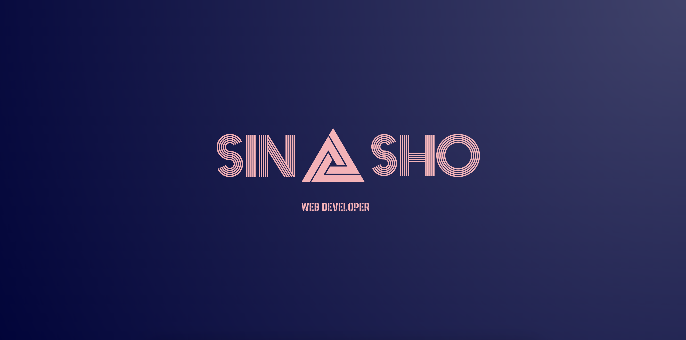

 
# Hey There! 
 

Appearance is an essential topic and when it comes to websites or apps, the importance is multiplied. In my opinion, if a company's app or website looks good, it can help them succeed in that business and more customers would rely on it. This was the motivation for me to become interested in web and Android application design. Now I am a Professional front-end developer.

 

### 🛠️ Technologies

 
💻 GitHub Profile Stats

